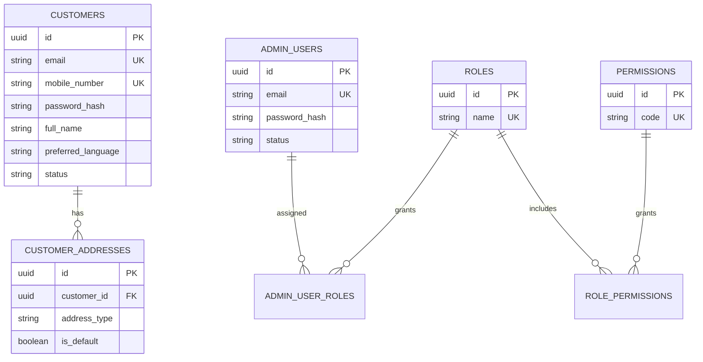
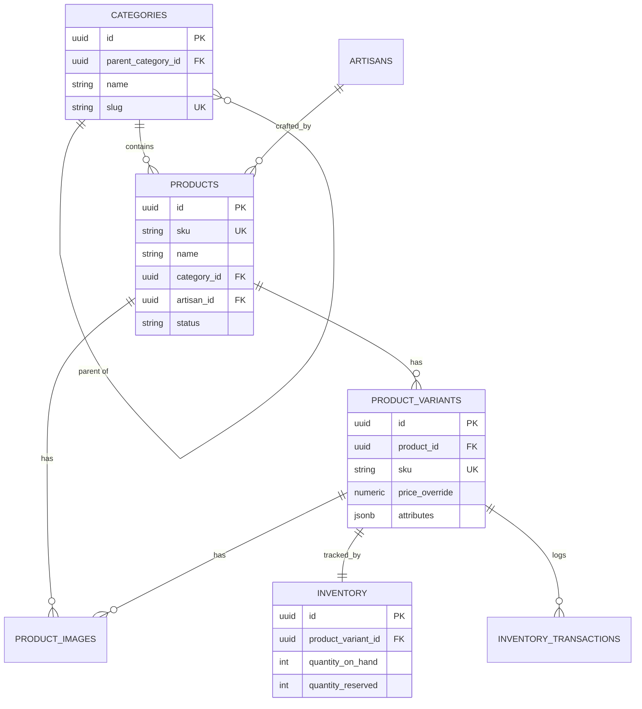
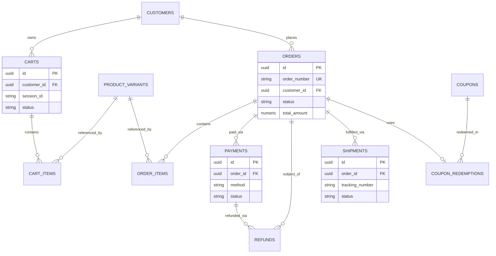
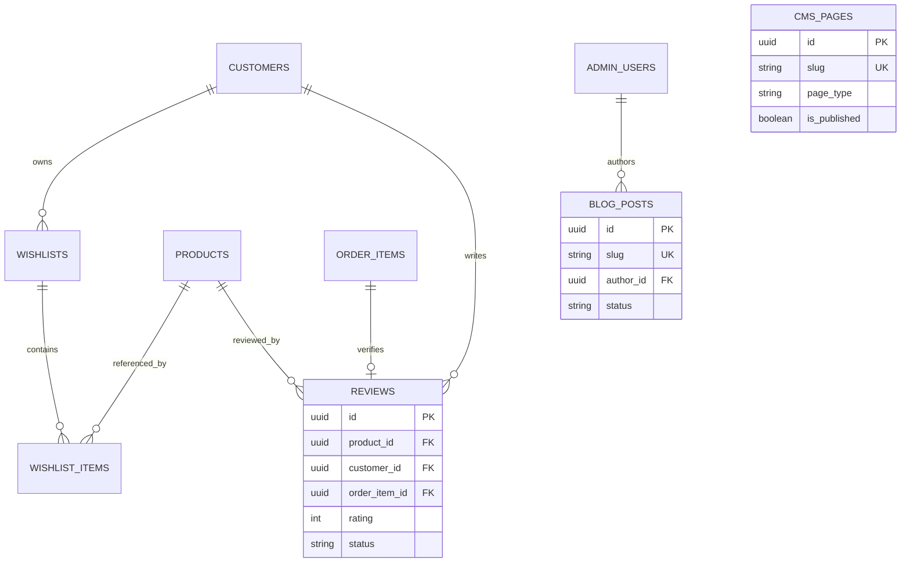

# Entity Relationship Diagram & Database Schema

**Project Name:** The Shatranj Heritage
**Document Version:** 1.0 (Draft)
**Database Engine:** PostgreSQL
**Status:** Draft
**Last Updated:** July 2026

---

## 1. Purpose

This document translates the conceptual data model in the [Software Requirements Specification](Software%20Requirements%20Specification.md) (Part 3) into an implementation-ready **Entity Relationship Diagram** and **field-level database schema**. It is the direct reference for writing migrations and ORM models.

It covers every entity needed for the MVP, plus the V2 entities (wishlist, reviews, coupons, CMS) so the schema doesn't need retrofitting later — implementation can still be staged by release even though the schema is designed as a whole. Vendor/Marketplace tables (V3, "Won't Have" for the current scope) are intentionally excluded; they'll be designed when that phase is scheduled.

---

## 2. Design Principles

Carried forward from the SRS, applied consistently across every table below:

| Principle | Rule |
| --- | --- |
| Primary keys | `UUID`, generated with `gen_random_uuid()` (via the `pgcrypto` extension) |
| Naming | Tables: `snake_case`, plural (`orders`, `product_variants`). Columns: `snake_case`, singular. FK columns: `<referenced_table_singular>_id` |
| Timestamps | `created_at` / `updated_at` on every table (`TIMESTAMPTZ`, UTC). Business-critical tables also get `deleted_at` for soft deletes |
| Status fields | `VARCHAR` + `CHECK` constraint listing allowed values (not native Postgres `ENUM`, so values can be added later without a type-altering migration) |
| Money | `NUMERIC(12,2)`, always paired with a `currency` column (`CHAR(3)`, default `'BDT'`) |
| Flexible attributes | Free-form product attributes (material, board size, finish, etc.) live in a `JSONB attributes` column rather than a fully normalized EAV table — enough structure for filtering via `GIN` index, without the complexity of a generic key-value schema this project doesn't need yet |
| Referential integrity | Foreign keys enforced at the database level; `ON DELETE RESTRICT` by default, `ON DELETE CASCADE` only where explicitly noted (e.g. cart items when a cart is deleted) |
| Order/price integrity | `order_items` snapshots product name, SKU, and price at time of purchase — orders must stay accurate even if the product catalog changes later (NFR-REL-001) |

---

## 3. Entity Summary

| Table | Domain | Scope | Notes |
| --- | --- | --- | --- |
| `customers` | Identity | MVP | Storefront accounts |
| `customer_addresses` | Identity | MVP | Multiple addresses per customer |
| `admin_users` | Identity | MVP | Back-office staff accounts |
| `roles` / `permissions` / `role_permissions` / `admin_user_roles` | Identity | MVP | RBAC (SRS Part 5 matrix) |
| `categories` | Catalog | MVP | Self-referencing for subcategories |
| `artisans` | Catalog | MVP | Artisan storytelling (BRD recommendation) |
| `products` / `product_variants` / `product_images` | Catalog | MVP | |
| `inventory` / `inventory_transactions` | Inventory | MVP | Transaction log for auditability |
| `carts` / `cart_items` | Shopping | MVP | Supports guest carts via `session_id` |
| `orders` / `order_items` | Order | MVP | |
| `payments` / `refunds` | Payment | MVP | Refunds required by BR-PAY-003 |
| `shipments` | Shipping | MVP | |
| `notifications_log` | Platform | MVP | Delivery audit trail |
| `audit_logs` | Platform | MVP | Admin action audit trail (NFR-AUD-001) |
| `coupons` / `coupon_redemptions` | Promotions | MVP (basic) / V2 (advanced) | Basic coupon support may ship in MVP per backlog note |
| `wishlists` / `wishlist_items` | Engagement | V2 | |
| `reviews` | Engagement | V2 | Verified-purchase only |
| `cms_pages` / `blog_posts` | Content | V2 | |

---

## 4. Entity Relationship Diagrams

Grouped by domain for readability. All relationships shown are enforced via foreign keys.

### 4.1 Identity & Access



### 4.2 Catalog & Inventory



### 4.3 Shopping, Orders, Payments & Shipping



### 4.4 Engagement, Content & Platform



---

## 5. Data Dictionary

### 5.1 `customers`

| Column | Type | Constraints | Description |
| --- | --- | --- | --- |
| id | UUID | PK, default `gen_random_uuid()` | |
| email | VARCHAR(255) | UNIQUE, nullable | Nullable because registration allows email OR mobile |
| mobile_number | VARCHAR(20) | UNIQUE, nullable | BD format, validated at application layer |
| password_hash | TEXT | NOT NULL | bcrypt/argon2 |
| full_name | VARCHAR(150) | NOT NULL | |
| preferred_language | VARCHAR(5) | DEFAULT `'en'` | `en` \| `bn` |
| status | VARCHAR(20) | CHECK IN (`active`,`inactive`,`suspended`) | |
| email_verified_at | TIMESTAMPTZ | nullable | V2 (FT-AUTH-008) |
| mobile_verified_at | TIMESTAMPTZ | nullable | V2 (FT-AUTH-009) |
| created_at / updated_at | TIMESTAMPTZ | NOT NULL | |
| deleted_at | TIMESTAMPTZ | nullable | Soft delete (US-CUS-007) |

CHECK constraint: `email IS NOT NULL OR mobile_number IS NOT NULL`.

### 5.2 `customer_addresses`

| Column | Type | Constraints | Description |
| --- | --- | --- | --- |
| id | UUID | PK | |
| customer_id | UUID | FK → customers.id, ON DELETE CASCADE | |
| label | VARCHAR(50) | nullable | "Home", "Office" |
| recipient_name | VARCHAR(150) | NOT NULL | |
| phone | VARCHAR(20) | NOT NULL | |
| address_line1 / address_line2 | VARCHAR(255) | line1 NOT NULL | |
| city / district | VARCHAR(100) | NOT NULL | |
| postal_code | VARCHAR(20) | nullable | |
| country | VARCHAR(2) | DEFAULT `'BD'` | ISO 3166-1 alpha-2 |
| address_type | VARCHAR(10) | CHECK IN (`shipping`,`billing`,`both`) | |
| is_default | BOOLEAN | DEFAULT false | One default enforced at application layer |
| created_at / updated_at | TIMESTAMPTZ | NOT NULL | |

### 5.3 `admin_users`, `roles`, `permissions`, `role_permissions`, `admin_user_roles`

| Table | Key Columns |
| --- | --- |
| `admin_users` | id, email (UNIQUE), password_hash, full_name, status, last_login_at, created_at, updated_at |
| `roles` | id, name (UNIQUE — e.g. `super_admin`, `inventory_manager`, `content_manager`, `marketing_manager`, `order_manager`, `customer_support`), description |
| `permissions` | id, code (UNIQUE — e.g. `products.write`, `orders.manage`), description |
| `role_permissions` | role_id FK, permission_id FK — composite PK |
| `admin_user_roles` | admin_user_id FK, role_id FK — composite PK |

An admin user can hold multiple roles; each role bundles a set of permissions, matching the RBAC matrix in SRS Part 5.

### 5.4 `categories`

| Column | Type | Constraints | Description |
| --- | --- | --- | --- |
| id | UUID | PK | |
| parent_category_id | UUID | FK → categories.id, nullable | Self-reference for subcategories |
| name | VARCHAR(100) | NOT NULL | |
| slug | VARCHAR(120) | UNIQUE, NOT NULL | |
| description | TEXT | nullable | |
| image_url | TEXT | nullable | |
| sort_order | INTEGER | DEFAULT 0 | |
| is_active | BOOLEAN | DEFAULT true | |
| created_at / updated_at | TIMESTAMPTZ | NOT NULL | |

### 5.5 `artisans`

| Column | Type | Constraints | Description |
| --- | --- | --- | --- |
| id | UUID | PK | |
| name | VARCHAR(150) | NOT NULL | |
| region | VARCHAR(100) | nullable | |
| bio | TEXT | nullable | Craftsmanship story (BRD recommendation) |
| photo_url | TEXT | nullable | |
| created_at / updated_at | TIMESTAMPTZ | NOT NULL | |

### 5.6 `products`

| Column | Type | Constraints | Description |
| --- | --- | --- | --- |
| id | UUID | PK | |
| sku | VARCHAR(50) | UNIQUE, NOT NULL | BR-PRO-001: every product has a unique SKU |
| name | VARCHAR(200) | NOT NULL | |
| slug | VARCHAR(220) | UNIQUE, NOT NULL | |
| description | TEXT | nullable | |
| category_id | UUID | FK → categories.id | |
| artisan_id | UUID | FK → artisans.id, nullable | |
| brand | VARCHAR(100) | nullable | |
| base_price | NUMERIC(12,2) | NOT NULL | |
| currency | CHAR(3) | DEFAULT `'BDT'` | |
| weight_grams | INTEGER | nullable | |
| status | VARCHAR(20) | CHECK IN (`draft`,`active`,`archived`) | Archived products excluded from search (BR-PRO-001) |
| meta_title / meta_description | VARCHAR(255) / TEXT | nullable | SEO |
| created_at / updated_at | TIMESTAMPTZ | NOT NULL | |
| deleted_at | TIMESTAMPTZ | nullable | |

### 5.7 `product_variants`

| Column | Type | Constraints | Description |
| --- | --- | --- | --- |
| id | UUID | PK | |
| product_id | UUID | FK → products.id, ON DELETE CASCADE | |
| sku | VARCHAR(50) | UNIQUE, NOT NULL | |
| variant_name | VARCHAR(150) | NOT NULL | e.g. "Walnut / Tournament Size" |
| price_override | NUMERIC(12,2) | nullable | Falls back to `products.base_price` if null |
| weight_grams | INTEGER | nullable | |
| attributes | JSONB | DEFAULT `'{}'` | material, board_size, finish, color, skill_level, recommended_age, country_of_origin (BR-PRO-003) |
| is_default | BOOLEAN | DEFAULT false | |
| status | VARCHAR(20) | CHECK IN (`active`,`archived`) | |
| created_at / updated_at | TIMESTAMPTZ | NOT NULL | |

### 5.8 `product_images`

| Column | Type | Constraints | Description |
| --- | --- | --- | --- |
| id | UUID | PK | |
| product_id | UUID | FK → products.id, ON DELETE CASCADE | |
| product_variant_id | UUID | FK → product_variants.id, nullable | Variant-specific image, if any |
| url | TEXT | NOT NULL | |
| alt_text | VARCHAR(255) | nullable | |
| sort_order | INTEGER | DEFAULT 0 | |
| is_primary | BOOLEAN | DEFAULT false | |
| created_at | TIMESTAMPTZ | NOT NULL | |

### 5.9 `inventory`

| Column | Type | Constraints | Description |
| --- | --- | --- | --- |
| id | UUID | PK | |
| product_variant_id | UUID | FK → product_variants.id, UNIQUE | One inventory row per variant |
| quantity_on_hand | INTEGER | NOT NULL, DEFAULT 0, CHECK >= 0 | |
| quantity_reserved | INTEGER | NOT NULL, DEFAULT 0, CHECK >= 0 | Reserved during checkout |
| reorder_threshold | INTEGER | DEFAULT 5 | Triggers BR-INV-002 low-stock alert |
| updated_at | TIMESTAMPTZ | NOT NULL | |

`quantity_available` is computed at query time as `quantity_on_hand - quantity_reserved` rather than stored, to avoid drift.

### 5.10 `inventory_transactions`

| Column | Type | Constraints | Description |
| --- | --- | --- | --- |
| id | UUID | PK | |
| product_variant_id | UUID | FK → product_variants.id | |
| change_type | VARCHAR(20) | CHECK IN (`restock`,`sale`,`return`,`damage`,`adjustment`) | |
| quantity_delta | INTEGER | NOT NULL | Signed (+/-) |
| reference_type | VARCHAR(30) | nullable | e.g. `order` |
| reference_id | UUID | nullable | e.g. the order id |
| note | TEXT | nullable | |
| created_by | UUID | FK → admin_users.id, nullable | Null for system-generated entries |
| created_at | TIMESTAMPTZ | NOT NULL | |

Append-only ledger — `inventory.quantity_on_hand` is derived from (and reconciled against) the sum of this table, satisfying NFR-AUD-001 traceability.

### 5.11 `carts` / `cart_items`

| `carts` Column | Type | Constraints |
| --- | --- | --- |
| id | UUID | PK |
| customer_id | UUID | FK → customers.id, nullable (guest cart) |
| session_id | VARCHAR(100) | nullable, indexed — identifies guest carts |
| status | VARCHAR(20) | CHECK IN (`active`,`converted`,`abandoned`) |
| created_at / updated_at | TIMESTAMPTZ | NOT NULL |

| `cart_items` Column | Type | Constraints |
| --- | --- | --- |
| id | UUID | PK |
| cart_id | UUID | FK → carts.id, ON DELETE CASCADE |
| product_variant_id | UUID | FK → product_variants.id |
| quantity | INTEGER | NOT NULL, CHECK > 0 |
| unit_price_snapshot | NUMERIC(12,2) | NOT NULL |
| created_at / updated_at | TIMESTAMPTZ | NOT NULL |

UNIQUE (`cart_id`, `product_variant_id`) — adding an existing item increments quantity instead of duplicating a row.

### 5.12 `orders` / `order_items`

| `orders` Column | Type | Constraints | Description |
| --- | --- | --- | --- |
| id | UUID | PK | |
| order_number | VARCHAR(30) | UNIQUE, NOT NULL | Human-readable, e.g. `SH-20260723-00042` |
| customer_id | UUID | FK → customers.id, nullable | Null for guest orders |
| guest_email / guest_phone | VARCHAR(255) / VARCHAR(20) | nullable | Required if `customer_id` is null |
| status | VARCHAR(20) | CHECK IN (`pending`,`awaiting_payment`,`confirmed`,`packed`,`shipped`,`delivered`,`cancelled`,`returned`,`refunded`) | BR-ORD-003 lifecycle |
| subtotal_amount / discount_amount / shipping_amount / tax_amount / total_amount | NUMERIC(12,2) | NOT NULL | |
| currency | CHAR(3) | DEFAULT `'BDT'` | |
| shipping_address_snapshot | JSONB | NOT NULL | Copied at order time — immune to later address edits |
| billing_address_snapshot | JSONB | nullable | |
| coupon_id | UUID | FK → coupons.id, nullable | |
| placed_at | TIMESTAMPTZ | NOT NULL | |
| created_at / updated_at | TIMESTAMPTZ | NOT NULL | |

| `order_items` Column | Type | Constraints | Description |
| --- | --- | --- | --- |
| id | UUID | PK | |
| order_id | UUID | FK → orders.id, ON DELETE RESTRICT | |
| product_variant_id | UUID | FK → product_variants.id | |
| product_name_snapshot | VARCHAR(200) | NOT NULL | |
| sku_snapshot | VARCHAR(50) | NOT NULL | |
| unit_price | NUMERIC(12,2) | NOT NULL | |
| quantity | INTEGER | NOT NULL, CHECK > 0 | |
| line_total | NUMERIC(12,2) | NOT NULL | |
| created_at | TIMESTAMPTZ | NOT NULL | |

### 5.13 `payments` / `refunds`

| `payments` Column | Type | Constraints | Description |
| --- | --- | --- | --- |
| id | UUID | PK | |
| order_id | UUID | FK → orders.id | |
| method | VARCHAR(20) | CHECK IN (`bkash`,`nagad`,`rocket`,`card`,`cod`) | |
| provider | VARCHAR(30) | nullable | e.g. `sslcommerz` |
| transaction_id | VARCHAR(100) | nullable, indexed | Gateway reference |
| status | VARCHAR(20) | CHECK IN (`pending`,`successful`,`failed`,`refunded`,`cancelled`) | |
| amount | NUMERIC(12,2) | NOT NULL | |
| currency | CHAR(3) | DEFAULT `'BDT'` | |
| raw_response | JSONB | nullable | Gateway payload for reconciliation |
| paid_at | TIMESTAMPTZ | nullable | |
| created_at / updated_at | TIMESTAMPTZ | NOT NULL | |

| `refunds` Column | Type | Constraints | Description |
| --- | --- | --- | --- |
| id | UUID | PK | |
| order_id | UUID | FK → orders.id | |
| payment_id | UUID | FK → payments.id | |
| amount | NUMERIC(12,2) | NOT NULL | |
| reason | TEXT | nullable | |
| status | VARCHAR(20) | CHECK IN (`requested`,`approved`,`rejected`,`completed`) | BR-ORD-003: refunds require business approval |
| requested_at | TIMESTAMPTZ | NOT NULL | |
| processed_by | UUID | FK → admin_users.id, nullable | |
| processed_at | TIMESTAMPTZ | nullable | |

### 5.14 `shipments`

| Column | Type | Constraints | Description |
| --- | --- | --- | --- |
| id | UUID | PK | |
| order_id | UUID | FK → orders.id | |
| courier_name | VARCHAR(100) | nullable | |
| tracking_number | VARCHAR(100) | nullable, indexed | |
| status | VARCHAR(20) | CHECK IN (`pending`,`dispatched`,`in_transit`,`delivered`,`failed`) | |
| estimated_delivery_date | DATE | nullable | |
| shipped_at / delivered_at | TIMESTAMPTZ | nullable | |
| created_at / updated_at | TIMESTAMPTZ | NOT NULL | |

### 5.15 `coupons` / `coupon_redemptions`

| `coupons` Column | Type | Constraints |
| --- | --- | --- |
| id | UUID | PK |
| code | VARCHAR(30) | UNIQUE, NOT NULL |
| discount_type | VARCHAR(10) | CHECK IN (`percentage`,`fixed`) |
| discount_value | NUMERIC(12,2) | NOT NULL |
| min_purchase_amount | NUMERIC(12,2) | DEFAULT 0 |
| usage_limit | INTEGER | nullable (null = unlimited) |
| usage_count | INTEGER | DEFAULT 0 |
| starts_at / expires_at | TIMESTAMPTZ | nullable |
| is_active | BOOLEAN | DEFAULT true |
| created_at / updated_at | TIMESTAMPTZ | NOT NULL |

| `coupon_redemptions` Column | Type | Constraints |
| --- | --- | --- |
| id | UUID | PK |
| coupon_id | UUID | FK → coupons.id |
| order_id | UUID | FK → orders.id |
| customer_id | UUID | FK → customers.id, nullable |
| redeemed_at | TIMESTAMPTZ | NOT NULL |

### 5.16 `wishlists` / `wishlist_items` *(V2)*

| Table | Key Columns |
| --- | --- |
| `wishlists` | id, customer_id (FK, UNIQUE — one wishlist per customer), created_at |
| `wishlist_items` | id, wishlist_id (FK, ON DELETE CASCADE), product_id (FK), created_at — UNIQUE (`wishlist_id`, `product_id`) |

### 5.17 `reviews` *(V2)*

| Column | Type | Constraints | Description |
| --- | --- | --- | --- |
| id | UUID | PK | |
| product_id | UUID | FK → products.id | |
| customer_id | UUID | FK → customers.id | |
| order_item_id | UUID | FK → order_items.id, UNIQUE | Enforces one review per purchased line item; proves verified purchase |
| rating | SMALLINT | NOT NULL, CHECK BETWEEN 1 AND 5 | |
| title | VARCHAR(150) | nullable | |
| body | TEXT | nullable | |
| status | VARCHAR(20) | CHECK IN (`pending`,`approved`,`rejected`) | Moderation (FT-REV-003) |
| created_at / updated_at | TIMESTAMPTZ | NOT NULL | |

### 5.18 `cms_pages` / `blog_posts` *(V2)*

| `cms_pages` Column | Type | Constraints |
| --- | --- | --- |
| id | UUID | PK |
| slug | VARCHAR(150) | UNIQUE, NOT NULL |
| title | VARCHAR(200) | NOT NULL |
| body | TEXT | NOT NULL |
| page_type | VARCHAR(20) | CHECK IN (`page`,`faq`,`policy`) |
| is_published | BOOLEAN | DEFAULT false |
| published_at | TIMESTAMPTZ | nullable |
| created_at / updated_at | TIMESTAMPTZ | NOT NULL |

| `blog_posts` Column | Type | Constraints |
| --- | --- | --- |
| id | UUID | PK |
| slug | VARCHAR(200) | UNIQUE, NOT NULL |
| title | VARCHAR(255) | NOT NULL |
| excerpt | VARCHAR(500) | nullable |
| body | TEXT | NOT NULL |
| cover_image_url | TEXT | nullable |
| author_id | UUID | FK → admin_users.id |
| status | VARCHAR(20) | CHECK IN (`draft`,`published`) |
| published_at | TIMESTAMPTZ | nullable |
| created_at / updated_at | TIMESTAMPTZ | NOT NULL |

### 5.19 `notifications_log`

| Column | Type | Constraints | Description |
| --- | --- | --- | --- |
| id | UUID | PK | |
| customer_id | UUID | FK → customers.id, nullable | |
| channel | VARCHAR(10) | CHECK IN (`email`,`sms`) | |
| template_code | VARCHAR(50) | NOT NULL | e.g. `order_confirmation` |
| recipient | VARCHAR(255) | NOT NULL | |
| status | VARCHAR(10) | CHECK IN (`sent`,`failed`) | |
| payload | JSONB | nullable | |
| sent_at | TIMESTAMPTZ | NOT NULL | |

### 5.20 `audit_logs`

| Column | Type | Constraints | Description |
| --- | --- | --- | --- |
| id | UUID | PK | |
| actor_type | VARCHAR(10) | CHECK IN (`admin`,`system`) | |
| actor_id | UUID | nullable | References `admin_users.id` when `actor_type = 'admin'` |
| action | VARCHAR(50) | NOT NULL | e.g. `product.price_updated` |
| entity_type | VARCHAR(50) | NOT NULL | |
| entity_id | UUID | NOT NULL | |
| before | JSONB | nullable | |
| after | JSONB | nullable | |
| created_at | TIMESTAMPTZ | NOT NULL | |

---

## 6. Indexing Strategy

Beyond the automatic indexes on primary keys and `UNIQUE` constraints:

| Table | Index | Reason |
| --- | --- | --- |
| `products` | `sku`, `slug`, `category_id`, GIN on `to_tsvector(name \|\| description)` | Lookup + full-text search (FR-SCH-001) |
| `product_variants` | `product_id`, `sku`, GIN on `attributes` | Variant lookup + attribute filtering |
| `customers` | `email`, `mobile_number` | Login lookup |
| `orders` | `order_number`, `customer_id`, `status` | Order lookup, customer order history, admin filtering |
| `payments` | `order_id`, `transaction_id` | Reconciliation |
| `shipments` | `tracking_number` | Customer tracking lookup |
| `cart_items`, `order_items` | `cart_id`, `order_id` | Parent lookups (near-certain query pattern) |
| `inventory_transactions` | `product_variant_id`, `created_at` | Stock history queries |
| `audit_logs` | `entity_type, entity_id`, `created_at` | Audit trail lookup |

---

## 7. Migration Ordering

Foreign key dependencies determine creation order:

```
roles, permissions
  -> role_permissions
admin_users
  -> admin_user_roles
customers
  -> customer_addresses
artisans
categories (self-referencing)
  -> products
    -> product_variants
      -> product_images
      -> inventory
      -> inventory_transactions
  -> carts -> cart_items
  -> coupons
  -> orders -> order_items
    -> payments -> refunds
    -> shipments
    -> coupon_redemptions
  -> wishlists -> wishlist_items      (V2)
  -> reviews                          (V2)
  -> cms_pages, blog_posts            (V2)
notifications_log
audit_logs
```

---

## 8. Open Questions for Implementation

* **Currency handling:** schema assumes single-currency (BDT) per the MVP constraint; multi-currency (V3) would need `orders`/`payments` to store an exchange rate at time of transaction.
* **Address snapshots:** `orders.shipping_address_snapshot` is JSONB rather than a FK to `customer_addresses`, so an order remains accurate even if the customer edits or deletes that address later — worth confirming this tradeoff (denormalized copy vs. immutable address history table) before implementation.
* **Full-text search:** MVP uses Postgres `tsvector`/`GIN`, matching the SRS's "PostgreSQL Full-Text Search now, Elasticsearch later" decision. No schema change needed to swap later since it's an index, not a structural dependency.
